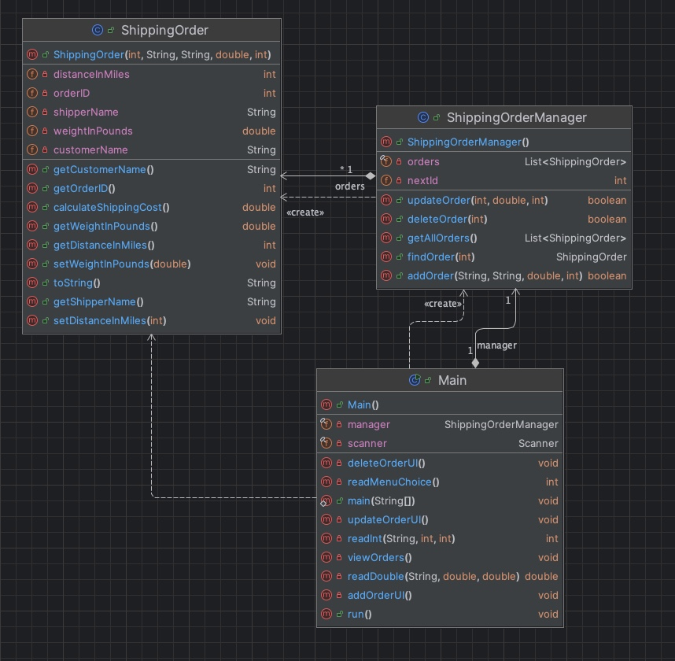
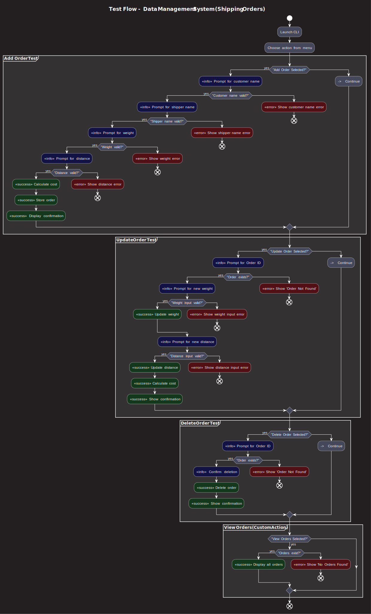
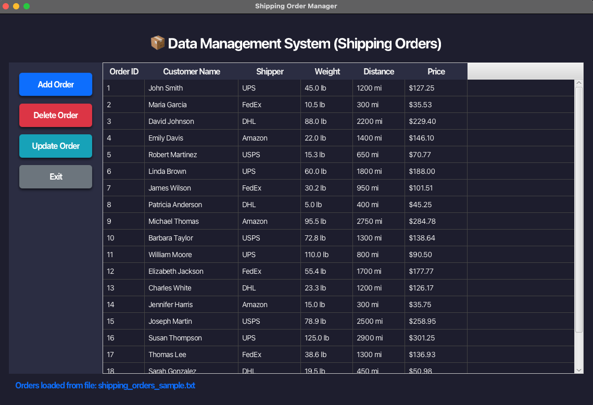

# 📦 Data Management System (Shipping Orders)

This project is a **Java-based console + JavaFX GUI application** for managing small-package shipping orders (like Amazon or e-commerce). It demonstrates strong **object-oriented design**, **layered architecture**, and robust **input validation**.

---

## 🚀 Features

- Add, view, update, and delete shipping orders
- Input validation: blocks blank entries, non-names, or invalid numbers
- Error handling for all operations (missing ID, bad format, etc.)
- Weight validation: 0.1–150 lbs
- Distance validation: up to 3000 miles
- Cost calculation based on realistic shipping rate
- Consistent and user-friendly JavaFX GUI
- Styled theme inspired by **OBS** (bluish dark theme with modern shadows)
- Clear messages for all actions (success, warning, failure)

---

## 📐 Layered Architecture

The app is divided into three layers for maintainability and scalability:

```
├── UI Layer (JavaFX + console)
├── Logic Layer (ShippingOrderManager.java)
│
└── Data Layer (in-memory via ArrayList<ShippingOrder>)
```

---

### ✅ UI Layer
- JavaFX GUI with stylish dark theme similar to OBS Studio
- Command-line fallback using `Scanner` and `System.out`
- Buttons for CRUD
- TableView to list orders
- Dialogs for validation, confirmations, and errors

### ✅ Logic Layer
- Encapsulated in `ShippingOrderManager`
- Performs all CRUD operations
- Returns boolean/object results
- Enforces business rules: weight, distance, ID lookups

### ✅ Data Layer
- Stores orders in a dynamic in-memory list
- Easily replaceable with SQL backend (JDBC-ready structure)

---

## 📊 UML Diagram

The following diagram shows the class relationships and method design:



---

## 🗺️ Test Flow Diagram (Flowchart)

The following flowchart illustrates the full test flow and input validation logic:



---

## 🧪 Phase 1 – Logic and Input Validation

Phase 1 focused on designing and implementing the core shipping order logic using Java classes, ensuring all business rules (like weight, distance, and cost calculations) were properly enforced. This included thorough input validation, clear error messages, and robust exception handling for data consistency and user-friendliness. The test flow diagram above illustrates how invalid or incomplete data is processed to guide the user toward correct input.

---

## 🧪 Phase 2 – JUnit Testing

Phase 2 introduced JUnit tests to systematically verify the logic and validation from Phase 1. Test cases covered all possible paths, including boundary conditions for weights and distances, as well as name validations. This phase ensured that the ShippingOrderManager behaves reliably across various scenarios.

▶️ **Video Demonstration**: [Watch on YouTube](https://www.youtube.com/watch?v=42L02K4EYRU)

---

## 🖥️ Phase 3 – JavaFX GUI Integration

In Phase 3, the console-based workflow was enhanced with a modern JavaFX GUI using a dark OBS-inspired theme. This GUI includes a TableView with formatted data, validation dialogs, confirmation prompts, and subtle button hover animations, all integrated seamlessly with the logic layer. It makes the user experience more intuitive and visually appealing.

▶️ **Video Demonstration**: [Watch on YouTube](https://www.youtube.com/watch?v=EZ-ITMU57j8)

---

## 🖼️ Sample GUI Preview

The JavaFX GUI phase currently looks like this:



---

## ⚙️ JavaFX Setup Instructions

If you are running the GUI, please follow these steps to add JavaFX to IntelliJ:

1. Download the JavaFX SDK from [https://gluonhq.com/products/javafx/](https://gluonhq.com/products/javafx/).
2. Unzip the folder to a known location.
3. In IntelliJ:
    - Go to **File > Project Structure > Libraries**
    - Click the **+** button and select the `lib` directory inside the JavaFX SDK you unzipped
    - Add all `.jar` files from that `lib` folder
4. Finally, in **Run > Edit Configurations**, add the following to VM options:
    - Add all `--module-path <your_path_here>/lib --add-modules javafx.controls,javafx.fxml` (Replace `<your_path_here>` with the actual path where you placed the JavaFX SDK.)

    > **Note:** If you do not see the VM options field, click  
    > **Modify Options > Add VM options**  
    > at the top of the configuration window to make it visible.

---

## 🧠 Input Validation Examples

- **Customer/Shipper names** must contain only letters and spaces
- **Weight** must be a valid number between `0.1` and `150`
- **Distance** must be a whole number between `1` and `3000`
- **Blank entries** or malformed input trigger warnings
- **Invalid order IDs** show appropriate error messages

---

## 📝 Latest Updates

- Phase 1 (Logic) finished with robust validation and error handling.
- Phase 2 (JUnit testing) implemented for all critical business rules.
- Phase 3 (GUI) completed with a modern, user-friendly OBS-inspired theme.
- Buttons have subtle drop shadows, hover transitions, and consistent colors.
- JavaFX TableView now includes units (e.g., lb, mi, $) and 2-decimal price formatting.
- Smoothed styling with improved fonts and better focus loss handling on selection.
- Application is fully ready for next step of JDBC database integration.

---


## ✅ Phase 4 – Adding a Database

Phase 4 is now complete. The application has been successfully connected to a MySQL database using JDBC. All CRUD operations now persist data in a normalized SQL schema. The `MainController` handles the login screen and database connection flow with live input from users.

- Added MySQL JDBC driver (Connector/J)
- Updated `MainController.java` to validate DB input
- Connection errors are handled and displayed in GUI
- Integrated JavaFX with JDBC using real credentials
- Modular code supports switching between in-memory and SQL backend

---

## 🔮 Future Enhancements

### Phase 5 – Advanced Features (Planned)
- Filter, sort, and search shipping records
- Export to CSV or PDF
- Role-based login and session management
- Dashboard with summary metrics and charts

---

## 👨‍💻 Author

**Julio Lopez**

📎 [LinkedIn Profile](https://www.linkedin.com/in/julio-lopez-380937282/)

---

> This project was developed with a focus on clean separation of concerns, testability, and modern UI. Each logic method is test-driven and designed for future growth with a professional-quality look and feel.

