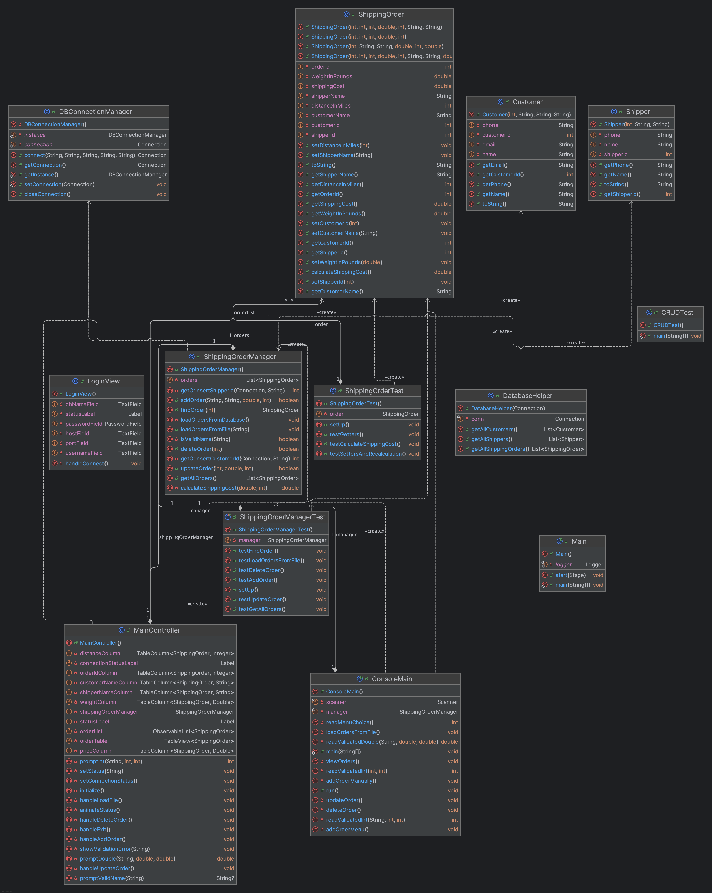

# 📦 Data Management System (Shipping Orders)

A **Java-based console + JavaFX GUI application** to manage small-package shipping orders (e.g., e-commerce or Amazon-style workflows). This project emphasizes **object-oriented design**, a **layered architecture**, and strong **input validation**.

---

## 🔁 Software Development Life Cycle (SDLC)

### 📋 1. Requirement Plan
Defines the goals and features of the system before development begins.

- **Functional Requirements:**
   - Create, read, update, delete (CRUD) shipping orders
   - Automatically calculate shipping cost based on weight and distance
   - Accept input via console and GUI
   - Validate user input and prevent invalid states

- **Non-Functional Requirements:**
   - Platform-independent (Java)
   - Input validation and error handling
   - Modular, testable, and scalable design
   - GUI with a user-friendly, modern interface

- **Core Data Attributes:**
   - `orderId`: Unique identifier
   - `customerName`: String (alphabetic only)
   - `shipperName`: String (alphabetic only)
   - `weightInPounds`: Double (0.1–150 lbs)
   - `distanceInMiles`: Integer (1–3000 miles)
   - `shippingCost`: Auto-calculated

---

### 🏗️ 2. Implementation Plan

- **Architecture:**
   - Layered structure separating UI, business logic, and data
   - GUI uses JavaFX with FXML
   - Final phase includes JDBC/MySQL database connection

- **Technology Stack:**
   - Java 17
   - JavaFX (FXML)
   - MySQL
   - JUnit for testing

- **Layer Evolution:**
   - Phase 1: Console-based CLI
   - Phase 2: Encapsulated business logic
   - Phase 3: GUI layer added (JavaFX)
   - Phase 4: SQL backend integrated via JDBC

---

### 🧪 3. Software Testing Plan

- **Approach:**
   - Test-Driven Development (TDD)
   - Unit tests created before logic implementation

- **Focus Areas:**
   - Functional correctness of all CRUD operations
   - Validation for edge cases (max weight/distance)
   - Invalid inputs (blank, negative, malformed)

- **Tools:**
   - JUnit for unit and boundary tests
   - Manual GUI testing for user interaction

---

## 🚀 Features

- Create, view, update, and delete shipping orders
- Real-time input validation (no blanks, invalid names, or bad numbers)
- Robust error handling with meaningful feedback
- Weight range enforced: 0.1–150 lbs
- Distance limit enforced: up to 3000 miles
- Smart shipping cost calculation using realistic rates
- Clean, dark-themed JavaFX interface inspired by **OBS Studio**
- Clear visual indicators for success, warnings, and errors

---

## 📐 Layered Architecture

The codebase is cleanly structured into three layers:


````
├── UI Layer (Console → JavaFX GUI)
├── Logic Layer (ShippingOrderManager.java)
└── Data Layer (ArrayList → SQL via JDBC)
````

---

### ✅ UI Layer
- JavaFX GUI with an OBS-inspired dark theme
- Command-line fallback with `Scanner` + `System.out`
- Full CRUD buttons and TableView display
- Alert dialogs for validation and confirmations

### ✅ Logic Layer
- Centralized in `ShippingOrderManager`
- Handles all business rules and CRUD operations

### ✅ Data Layer
- In-memory `ArrayList<ShippingOrder>` storage
- Easily swappable for JDBC-based SQL backend

---

## 📊 UML Diagram

Class structure and relationships:


---

## 🗺️ Test Flow Diagram (Flowchart)

Full test/validation logic shown here:


---

## 🧪 Phase 1 – Logic and Input Validation

Implemented core logic with plain Java classes. Business rules like valid weight/distance were enforced with strong input validation and exception handling for smooth execution.

---

## 🧪 Phase 2 – JUnit Testing

JUnit tests validate all logic from Phase 1. Covers normal cases, edge inputs, and error handling to ensure method reliability.

▶️ **Video Demo**: [Watch on YouTube](https://www.youtube.com/watch?v=42L02K4EYRU)

---

## 🖥️ Phase 3 – JavaFX GUI Integration

Transitioned to a modern, user-friendly JavaFX interface with dark mode, TableView components, and sleek visuals.

▶️ **Video Demo**: [Watch on YouTube](https://www.youtube.com/watch?v=EZ-ITMU57j8)

---

## 🖼️ Sample GUI Preview


---

## ⚙️ JavaFX Setup Instructions

To run the GUI in IntelliJ:

1. Download JavaFX SDK: [gluonhq.com/products/javafx](https://gluonhq.com/products/javafx/)
2. Extract the SDK
3. In IntelliJ:
   - Go to **File > Project Structure > Libraries**
   - Add all `.jar` files from the `lib` folder
4. Add VM options in **Run > Edit Configurations**:
   - Add all `--module-path <your_path_here>/lib --add-modules javafx.controls,javafx.fxml` (Replace `<your_path_here>` with the actual path where you placed the JavaFX SDK.)

> If VM options aren’t visible, click  
> **Modify Options > Add VM options**

---

## 🧠 Input Validation Examples

- **Names**: Alphabetic only, max 30 characters
- **Weight**: Between `0.1` and `150` lbs
- **Distance**: Between `1` and `3000` miles
- **Blank/invalid entries** trigger warnings
- **Bad IDs** trigger clear error messages

---

## 📝 Latest Updates

- ✅ Phase 1: Business logic + validation complete
- ✅ Phase 2: All core methods tested via JUnit
- ✅ Phase 3: Full-featured JavaFX UI implemented
- 🎨 Enhanced styling with shadows and effects
- 🏁 Finalized JDBC integration for live data handling

---

## ✅ Phase 4 – Adding a Database

JDBC support is live! App now persists data to MySQL:

- JDBC driver added
- `MainController.java` prompts for DB login
- UI displays connection errors cleanly
- Seamless JavaFX ↔ SQL communication
- Modular backend ready for future data sources

---
## 📊 UML Diagram (Final – Post Phase 4)

This updated UML diagram reflects the complete system after Phase 4, including:

- Full database integration via `DBConnectionManager` and `DatabaseHelper`
- JavaFX interface logic in `MainController` and `LoginView`
- Business logic encapsulated in `ShippingOrderManager`
- Console fallback with `ConsoleMain`
- Unit tests for both individual orders and the manager class
- Entity relationships: `Customer`, `Shipper`, and `ShippingOrder`



---

## 🔮 Future Enhancements

### Phase 5 – Advanced Features (Planned)

- Search, filter, and sort orders by customer, shipper, weight, etc.
- Export data to CSV or PDF
- Role-based login with sessions
- Admin dashboard with visual metrics

---

## 👨‍💻 Author

**Julio Lopez**  
📎 [LinkedIn Profile](https://www.linkedin.com/in/julio-lopez-380937282/)

---

> Built for clarity, modularity, and scale — this system is test-driven and designed with clean architecture principles, ready for real-world deployment.
