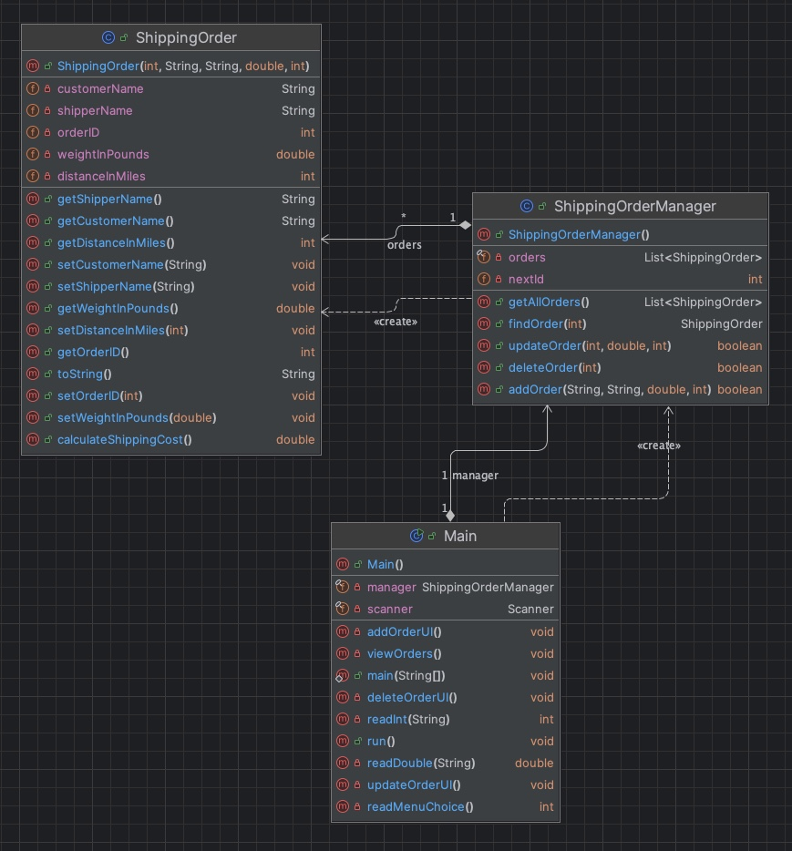

# 📦 Data Management System (Shipping Orders)

This project is a **Java-based console application** for managing small-package shipping orders (like Amazon or e-commerce). It demonstrates strong **object-oriented design**, **layered architecture**, and robust **input validation**.

---

## 🚀 Features

- Add, view, update, and delete shipping orders
- Input validation: blocks blank entries, non-names, or invalid numbers
- Error handling for all operations (missing ID, bad format, etc.)
- Weight validation: 0.1–150 lbs
- Distance validation: up to 3000 miles
- Cost calculation based on realistic shipping rate
- Clear messages for all actions (success, warning, failure)

---

## 📐 Layered Architecture

The app is divided into three layers for maintainability and scalability:

UI Layer (Main.java)
│
├── Logic Layer (ShippingOrderManager.java)
│
└── Data Layer (in-memory via ArrayList<ShippingOrder>)

### ✅ UI Layer
- Command-line interface using `Scanner` and `System.out`
- Handles user prompts and validations
- Displays feedback (warnings, errors, confirmations)

### ✅ Logic Layer
- Encapsulated in `ShippingOrderManager`
- Performs all CRUD operations
- Returns boolean/object results (no `void` logic methods)
- Enforces business rules: weight, distance, ID lookups

### ✅ Data Layer
- Stores orders in a dynamic in-memory list
- Easily replaceable with SQL backend (JDBC-ready structure)

---

## 📊 UML Diagram

The following diagram shows the class relationships and method design:

---

## 🧠 Input Validation Examples

- **Customer/Shipper names** must contain only letters and spaces
- **Weight** must be a valid number between `0.1` and `150`
- **Distance** must be a whole number between `1` and `3000`
- **Blank entries** or malformed input trigger warnings
- **Invalid order IDs** show appropriate error messages

---

## 🔮 Future Enhancements

### Phase 3 – GUI (JavaFX)
- Buttons for CRUD operations
- TableView for order summaries
- Dialogs for errors and confirmations

### Phase 4 – Database Integration
- JDBC support with SQL schema
- Load/save orders to a persistent backend
- Pre-validation before database write operations

---

## 👨‍💻 Author

**Julio Lopez**

📎 [LinkedIn Profile](https://www.linkedin.com/in/julio-lopez-380937282/)

---

> This project was developed with a focus on clean separation of concerns, testability, and readiness for future GUI/database expansion. All logic methods return values to support unit testing and better system feedback.
